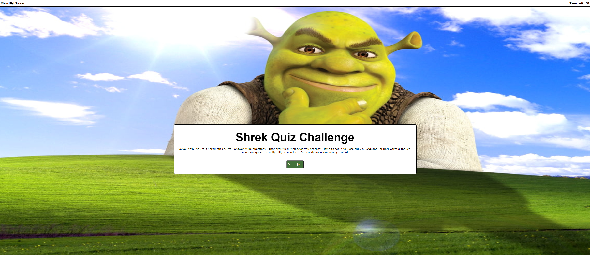

Greetings!

Thank you checking out my Shrek Quiz!

This was a simple quiz that utilize javascript to dynamically change attributes, text, and elements
to keep track of information via local storage.  Users would be able to select choices to question
with wrong answer decrementing their time/score while correct answers would allow them to progress
to the next question.

The timer function continually counts down and when it expires, the game is over and user is prompted
to either try again or quit.  When the user completes the quiz with time left, that becomes their
score and they are able to record it by inputting their name which will then be displayed on a 
high score board.  Users will then have a choice to return to main menu or clear scores.  As an added
bonus, the Shrek theme song is set to autoplay.  However, this may occasionally misfire, but there is
a play button in the top left hand corner.

I hope you enjoy, thank you!

You can find this project at
https://yippeejimmee.github.io/ShrekQuiz/

